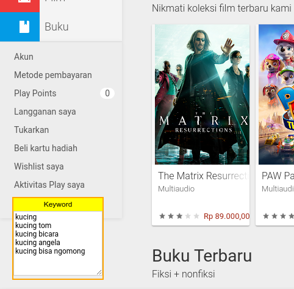
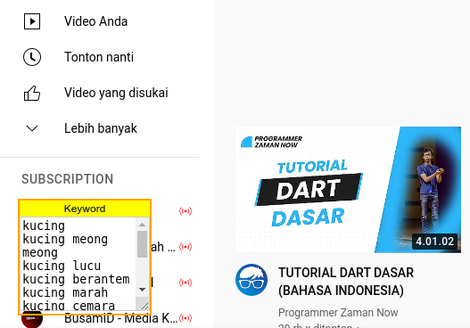

# Keyword Suggest

Tools yang berguna untuk mencatat keyword dari Google, Play Store, dan YouTube

## Screenshot

Google:

Play Store:

YouTube:

## Instalasi

1. Install [OrangeMonkey](https://chrome.google.com/webstore/detail/orangemonkey/ekmeppjgajofkpiofbebgcbohbmfldaf?hl=en) (ekstensi browser)
2. Klik https://github.com/mzaini30/keyword-suggest/raw/master/app.user.js